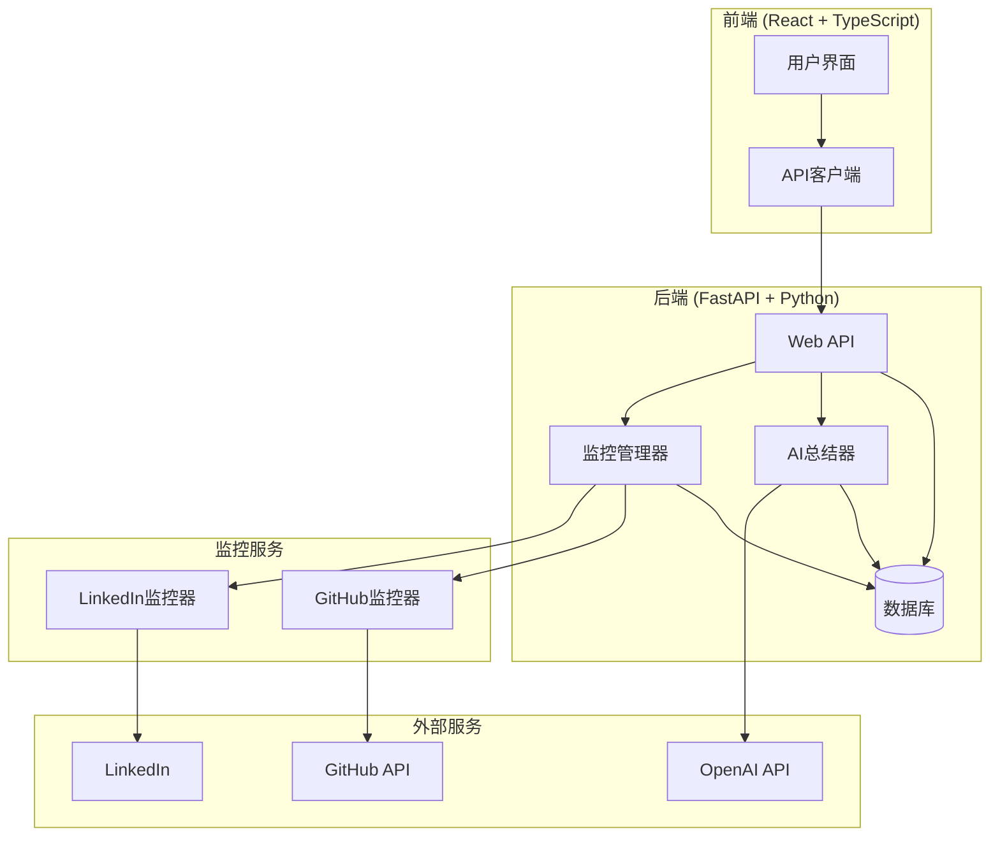

# Inspector - 社交动态监控系统

[](https://python.org)
[](https://fastapi.tiangolo.com)
[](https://reactjs.org)
[](https://typescriptlang.org)
[](LICENSE)

> 一个强大的团队社交动态监控和AI总结系统，支持LinkedIn、GitHub等平台的实时监控和智能报告生成。

## 🌟 功能特性

### 📊 核心功能

- **多平台监控**: 支持LinkedIn、GitHub等主流社交平台
- **实时更新**: 自动监控团队成员的最新动态
- **AI智能总结**: 使用OpenAI GPT生成每日/每周活动总结
- **可视化界面**: 现代化的React前端界面
- **数据统计**: 详细的成员活动和监控统计

### 🔧 技术特性

- **模块化架构**: 易于扩展和维护的监控器系统
- **RESTful API**: 完整的后端API接口
- **实时调度**: 支持定时监控和报告生成
- **数据持久化**: SQLite/PostgreSQL数据库支持
- **容器化部署**: Docker和Docker Compose支持

## 🏗️ 系统架构



## 🚀 快速开始

### 环境要求

- Python 3.12+
- Node.js 18+
- uv (Python包管理器)
- npm 或 yarn

### 1. 克隆项目

```bash
git clone <repository-url>
cd Inspector
```

### 2. 配置环境

```bash
# 复制环境配置模板
cp config/env.example .env

# 编辑配置文件
nano .env
```

**必需的环境变量**:

```env
# OpenAI API配置
OPENAI_API_KEY=your-openai-api-key-here
OPENAI_BASE_URL=https://api.openai.com/v1
OPENAI_MODEL=gpt-3.5-turbo

# GitHub API配置 (可选)
GITHUB_TOKEN=your-github-personal-access-token

# 数据库配置
DATABASE_URL=sqlite:///./inspector.db

# 邮件通知配置 (可选)
EMAIL_RECIPIENTS=recipient1@example.com,recipient2@example.com
```

### 3. 安装依赖

```bash
# 安装Python依赖
uv sync

# 安装前端依赖
cd frontend
npm install
cd ..
```

### 4. 启动服务

```bash
# 方式1: 使用启动脚本
chmod +x start-all.sh
./start-all.sh

# 方式2: 手动启动
# 终端1 - 启动后端
uv run python main.py

# 终端2 - 启动前端
cd frontend && npm start
```

### 5. 访问应用

- **前端界面**: http://localhost:3000
- **API文档**: http://localhost:8000/docs
- **健康检查**: http://localhost:8000/health

### 6. 验证配置

```bash
# 验证所有配置
uv run python tests/validate_config.py

# 跳过外部服务测试 (OpenAI, GitHub)
uv run python tests/validate_config.py --skip-external

# 跳过API端点测试 (后端未启动时)
uv run python tests/validate_config.py --skip-api

# 跳过外部服务和API端点测试
uv run python tests/validate_config.py --skip-external --skip-api

# 测试AI配置
uv run python tests/test_openai_config.py

# 测试阿里云通义千问配置
uv run python tests/test_aliyun_openai.py

# 测试GitHub配置
uv run python tests/test_github_token.py
```

## 📖 使用指南

### 添加团队成员

1. 访问 http://localhost:3000/members
2. 点击"添加成员"按钮
3. 填写成员信息（姓名、邮箱、职位）
4. 保存成员信息

### 配置社交链接

1. 在成员列表中找到目标成员
2. 点击"添加社交配置"
3. 选择平台（GitHub/LinkedIn）
4. 输入个人主页URL和用户名
5. 保存配置

### 运行监控

1. 访问 http://localhost:3000
2. 点击"运行监控"按钮
3. 系统将自动抓取所有配置的社交动态
4. 查看实时更新的活动列表

### 生成AI总结

1. 在仪表板页面点击"生成每日总结"
2. 系统将使用OpenAI分析最近的活动
3. 查看生成的智能总结报告

## 🤖 AI平台配置

系统支持多种AI平台，可以通过配置不同的base URL来使用不同的模型服务。

### OpenAI官方API

```env
OPENAI_API_KEY=sk-your-openai-api-key
OPENAI_BASE_URL=https://api.openai.com/v1
OPENAI_MODEL=gpt-3.5-turbo
```

### Azure OpenAI

```env
OPENAI_API_KEY=your-azure-api-key
OPENAI_BASE_URL=https://your-resource.openai.azure.com/openai/deployments/your-deployment
OPENAI_MODEL=gpt-35-turbo
```

### 其他兼容平台

```env
OPENAI_API_KEY=your-api-key
OPENAI_BASE_URL=https://api.your-platform.com/v1
OPENAI_MODEL=gpt-3.5-turbo
```

### 测试配置

运行以下命令测试AI配置是否正确：

```bash
uv run python test_openai_config.py
```

**详细配置示例**: 查看 [AI平台配置示例](docs/ai_config_examples.md) 文档

### GitHub配置

参考 [GitHub配置指南](docs/GITHUB_SETUP.md) 创建Personal Access Token

### 阿里云通义千问配置

参考 [阿里云配置指南](docs/ALIYUN_SETUP.md) 配置AI总结服务

## 🔧 API接口

### 成员管理

```bash
# 获取所有成员
GET /api/v1/members/

# 创建新成员
POST /api/v1/members/
{
  "name": "张三",
  "email": "zhangsan@example.com",
  "position": "软件工程师"
}

# 添加社交配置
POST /api/v1/members/{member_id}/social-profiles/
{
  "platform": "github",
  "profile_url": "https://github.com/username",
  "username": "username"
}
```

### 监控管理

```bash
# 获取监控统计
GET /api/v1/monitoring/stats

# 运行监控
POST /api/v1/monitoring/run-monitoring

# 获取活动列表
GET /api/v1/monitoring/activities

# 生成每日总结
POST /api/v1/monitoring/generate-daily-summary
```

## 🐳 Docker部署

### 使用Docker Compose

```bash
# 构建并启动所有服务
docker-compose up -d

# 查看服务状态
docker-compose ps

# 查看日志
docker-compose logs -f inspector
```

### 自定义部署

```bash
# 构建镜像
docker build -t inspector .

# 运行容器
docker run -d \
  --name inspector \
  -p 8000:8000 \
  --env-file .env \
  inspector
```

## 📁 项目结构

```
Inspector/
├── app/                          # 后端应用
│   ├── api/v1/                   # API路由
│   │   ├── members.py           # 成员管理API
│   │   └── monitoring.py        # 监控管理API
│   ├── core/                     # 核心配置
│   │   ├── config/              # 配置管理
│   │   └── database/            # 数据库配置
│   ├── models/                   # 数据模型
│   │   ├── member.py            # 成员模型
│   │   └── schemas.py           # Pydantic模式
│   └── services/                 # 业务服务
│       ├── monitors/            # 监控器
│       │   ├── base_monitor.py  # 基础监控器
│       │   ├── linkedin_monitor.py
│       │   ├── github_monitor.py
│       │   └── monitor_manager.py
│       └── summarizers/         # 总结器
│           └── llm_summarizer.py
├── frontend/                     # 前端应用
│   ├── src/
│   │   ├── components/          # React组件
│   │   ├── pages/              # 页面组件
│   │   ├── services/           # API服务
│   │   └── types/              # TypeScript类型
│   ├── public/                 # 静态资源
│   └── package.json
├── main.py                      # 应用入口
├── pyproject.toml              # Python配置
├── docker-compose.yml          # Docker配置
├── Dockerfile                  # Docker镜像
└── README.md                   # 项目文档
```

## 🔄 定时任务

系统支持以下定时任务：

- **监控任务**: 每30分钟自动运行一次（可配置）
- **每日总结**: 每天上午9点自动生成
- **每周总结**: 每周一上午9点自动生成

### 配置定时任务

在 `.env` 文件中修改：

```env
MONITORING_INTERVAL_MINUTES=30
SUMMARY_TIME=09:00
WEEKLY_SUMMARY_DAY=monday
```

## 🛠️ 开发指南

### 添加新的监控平台

1. 在 `app/services/monitors/` 创建新的监控器
2. 继承 `BaseMonitor` 类
3. 实现必要的抽象方法
4. 在 `MonitorManager` 中注册新监控器

### 扩展AI总结功能

1. 在 `app/services/summarizers/` 创建新的总结器
2. 实现总结接口
3. 在API中注册新的总结端点

### 运行测试

```bash
# 运行后端测试
uv run pytest

# 运行前端测试
cd frontend && npm test
```

## 🐛 故障排除

### 常见问题

**Q: 监控无法获取数据**
A: 检查网络连接和API密钥配置，确保目标平台可访问

**Q: AI总结生成失败**
A: 验证OpenAI API密钥是否正确，检查API配额

**Q: 前端无法连接后端**
A: 确认后端服务正在运行，检查端口配置和CORS设置

**Q: 数据库连接失败**
A: 检查数据库URL配置，确保数据库服务可用

### 日志查看

```bash
# 查看后端日志
tail -f logs/app.log

# 查看Docker日志
docker-compose logs -f inspector
```

## 📊 性能优化

### 数据库优化

- 定期清理旧的活动数据
- 为频繁查询的字段添加索引
- 使用连接池管理数据库连接

### 监控优化

- 调整监控间隔以减少API调用
- 实现增量更新避免重复数据
- 使用缓存减少重复请求

## 🤝 贡献指南

1. Fork 项目
2. 创建功能分支 (`git checkout -b feature/AmazingFeature`)
3. 提交更改 (`git commit -m 'Add some AmazingFeature'`)
4. 推送到分支 (`git push origin feature/AmazingFeature`)
5. 打开 Pull Request

## 📄 许可证

本项目采用 Business Source License 1.1 (BSL) - 查看 [LICENSE](LICENSE) 文件了解详情

**重要说明**：
- 本软件受 BSL 许可证永久保护
- 商业使用需要获得许可
- 禁止直接竞争的商业产品使用
- 个人和非商业使用允许

## 🙏 致谢

- [FastAPI](https://fastapi.tiangolo.com/) - 现代、快速的Web框架
- [React](https://reactjs.org/) - 用户界面库
- [OpenAI](https://openai.com/) - AI服务提供商
- [Tailwind CSS](https://tailwindcss.com/) - CSS框架

---

**Inspector** - 让团队协作更智能，让信息获取更高效！ 🚀
