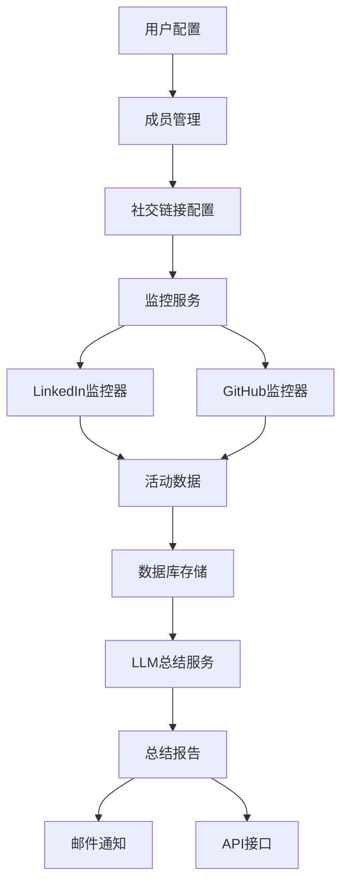

# Inspector Cursor 项目总结

## 项目概述

Inspector Cursor 是一个功能完整的社交动态监控和总结服务器端应用，能够自动监控团队成员在LinkedIn、GitHub等平台的动态，并使用LLM生成定期总结报告。

## 已实现功能

### ✅ 核心功能

- **成员管理**: 完整的团队成员CRUD操作
- **社交链接配置**: 支持LinkedIn、GitHub等平台
- **实时监控**: 自动抓取社交平台动态
- **LLM总结**: 使用OpenAI GPT生成智能报告
- **定时任务**: 自动执行监控和总结任务
- **RESTful API**: 完整的API接口

### ✅ 技术架构

- **后端框架**: FastAPI + SQLAlchemy
- **数据库**: SQLite (可扩展至PostgreSQL)
- **监控器**: 模块化设计，易于扩展新平台
- **LLM集成**: OpenAI API集成
- **部署**: Docker + Docker Compose支持

### ✅ 项目结构

```
Inspector-Cursor/
├── app/
│   ├── api/v1/           # API路由
│   ├── core/             # 核心配置
│   ├── models/           # 数据模型
│   ├── services/         # 业务逻辑
│   └── utils/            # 工具函数
├── Dockerfile            # Docker配置
├── docker-compose.yml    # Docker Compose配置
├── deploy.sh            # 部署脚本
├── example_usage.py     # 使用示例
└── test_app.py          # 测试脚本
```

## 系统架构图



## API接口

### 成员管理

- `POST /api/v1/members/` - 创建成员
- `GET /api/v1/members/` - 获取成员列表
- `GET /api/v1/members/{id}` - 获取成员详情
- `PUT /api/v1/members/{id}` - 更新成员
- `DELETE /api/v1/members/{id}` - 删除成员

### 社交配置

- `POST /api/v1/members/{id}/social-profiles` - 添加社交链接
- `GET /api/v1/members/{id}/social-profiles` - 获取社交链接
- `PUT /api/v1/members/{id}/social-profiles/{profile_id}` - 更新社交链接
- `DELETE /api/v1/members/{id}/social-profiles/{profile_id}` - 删除社交链接

### 监控管理

- `POST /api/v1/monitoring/run-monitoring` - 运行监控
- `GET /api/v1/monitoring/stats` - 获取统计信息
- `GET /api/v1/monitoring/activities` - 获取活动列表
- `POST /api/v1/monitoring/generate-daily-summary` - 生成每日总结
- `POST /api/v1/monitoring/generate-weekly-summary` - 生成每周总结

## 部署方式

### 本地开发

```bash
# 安装依赖
uv sync

# 配置环境
cp env.example .env
# 编辑 .env 文件

# 运行应用
uv run python main.py
```

### Docker部署

```bash
# 使用Docker Compose
docker-compose up -d

# 或单独使用Docker
docker build -t inspector-cursor .
docker run -d -p 8000:8000 --env-file .env inspector-cursor
```

## 配置说明

### 必需配置

- `OPENAI_API_KEY`: OpenAI API密钥（用于LLM总结）

### 可选配置

- `GITHUB_TOKEN`: GitHub Personal Access Token
- `LINKEDIN_USERNAME/PASSWORD`: LinkedIn登录信息
- `DATABASE_URL`: 数据库连接字符串
- `EMAIL_*`: 邮件通知配置

## 定时任务

- **监控任务**: 每小时检查一次社交动态
- **每日总结**: 每天上午9点生成前一天的总结
- **每周总结**: 每周一上午9点生成上周总结

## 扩展性

### 添加新社交平台

1. 在 `app/services/monitors/` 下创建新的监控器
2. 继承 `BaseMonitor` 类
3. 实现必要的方法
4. 在 `MonitorManager` 中注册新监控器

### 自定义总结模板

修改 `LLMSummarizer` 中的提示词模板来自定义总结格式。

## 测试验证

项目包含完整的测试脚本：

- `test_app.py`: API功能测试
- `example_usage.py`: 使用示例

## 下一步计划

### 短期改进

1. 添加更多社交平台支持（Twitter、微博等）
2. 实现邮件通知功能
3. 添加Web管理界面
4. 完善错误处理和日志记录

### 长期规划

1. 支持更多LLM提供商
2. 添加数据分析和可视化
3. 实现多租户支持
4. 添加移动端应用

## 技术亮点

1. **模块化设计**: 易于扩展和维护
2. **异步处理**: 高效的并发监控
3. **智能总结**: LLM驱动的报告生成
4. **容器化部署**: 便于生产环境部署
5. **完整API**: RESTful接口设计

## 总结

Inspector Cursor 是一个功能完整、架构清晰的社交动态监控系统，具备良好的扩展性和可维护性。通过模块化设计和现代技术栈，为团队提供了强大的社交媒体活动监控和总结能力。
