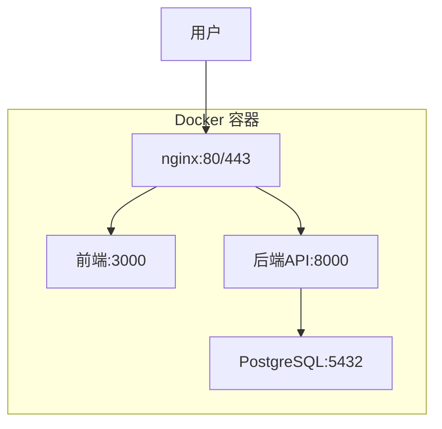

# Inspector 部署指南

本指南将帮助你将 Inspector 服务部署到生产服务器上，使用域名 `brianchiu.top`。

## 系统架构



## 前置要求

### 服务器要求
- **操作系统**: Ubuntu 20.04+ 或 CentOS 8+
- **内存**: 最少 2GB RAM
- **存储**: 最少 10GB 可用空间
- **网络**: 开放端口 80 和 443

### 软件要求
- Docker 20.10+
- Docker Compose 2.0+
- Git

## 部署步骤

### 1. 服务器准备

#### 安装 Docker
```bash
# Ubuntu/Debian
curl -fsSL https://get.docker.com -o get-docker.sh
sudo sh get-docker.sh
sudo usermod -aG docker $USER

# CentOS/RHEL
sudo yum install -y docker
sudo systemctl start docker
sudo systemctl enable docker
sudo usermod -aG docker $USER
```

#### 安装 Docker Compose
```bash
sudo curl -L "https://github.com/docker/compose/releases/latest/download/docker-compose-$(uname -s)-$(uname -m)" -o /usr/local/bin/docker-compose
sudo chmod +x /usr/local/bin/docker-compose
```

### 2. 域名配置

确保你的域名 `brianchiu.top` 和 `www.brianchiu.top` 都指向你的服务器 IP 地址。

```bash
# 检查域名解析
nslookup brianchiu.top
nslookup www.brianchiu.top
```

### 3. 获取 SSL 证书

#### 使用 Let's Encrypt (推荐)
```bash
# 安装 certbot
sudo apt-get update
sudo apt-get install certbot

# 获取证书
sudo certbot certonly --standalone -d brianchiu.top -d www.brianchiu.top

# 证书位置
# /etc/letsencrypt/live/brianchiu.top/fullchain.pem
# /etc/letsencrypt/live/brianchiu.top/privkey.pem
```

#### 复制证书到项目目录
```bash
# 创建 SSL 目录
mkdir -p ssl

# 复制证书文件
sudo cp /etc/letsencrypt/live/brianchiu.top/fullchain.pem ssl/brianchiu.top.crt
sudo cp /etc/letsencrypt/live/brianchiu.top/privkey.pem ssl/brianchiu.top.key

# 设置权限
sudo chown $USER:$USER ssl/*
chmod 600 ssl/*
```

### 4. 环境配置

#### 创建环境变量文件
```bash
cp config/env.example .env
```

#### 编辑 .env 文件
```bash
# 数据库配置
DB_PASSWORD=your_secure_password_here

# API 配置
API_HOST=0.0.0.0
API_PORT=8000
LOG_LEVEL=INFO
ENVIRONMENT=production

# 数据库 URL (自动生成)
DATABASE_URL=postgresql://inspector:${DB_PASSWORD}@db:5432/inspector

# OpenAI 配置
OPENAI_API_KEY=your_openai_api_key_here
OPENAI_MODEL=gpt-4

# GitHub 配置 (可选)
GITHUB_TOKEN=your_github_token_here

# LinkedIn 配置 (可选)
LINKEDIN_USERNAME=your_linkedin_username
LINKEDIN_PASSWORD=your_linkedin_password

# 邮件配置 (可选)
SMTP_HOST=smtp.gmail.com
SMTP_PORT=587
SMTP_USER=your_email@gmail.com
SMTP_PASSWORD=your_app_password
```

### 5. 部署应用

#### 克隆代码
```bash
git clone https://github.com/bugmaker2/Inspector.git
cd Inspector
```

#### 启动服务
```bash
# 给部署脚本执行权限
chmod +x deploy.sh

# 启动所有服务
./deploy.sh start
```

#### 检查服务状态
```bash
# 查看服务状态
./deploy.sh status

# 查看日志
./deploy.sh logs
```

### 6. 验证部署

#### 健康检查
```bash
# 检查后端健康状态
curl https://brianchiu.top/health

# 检查前端访问
curl -I https://brianchiu.top
```

#### 浏览器访问
打开浏览器访问 `https://brianchiu.top` 确认应用正常运行。

## 管理命令

### 服务管理
```bash
# 启动服务
./deploy.sh start

# 停止服务
./deploy.sh stop

# 重启服务
./deploy.sh restart

# 查看状态
./deploy.sh status

# 查看日志
./deploy.sh logs
```

### 数据管理
```bash
# 备份数据库
./deploy.sh backup

# 更新应用
./deploy.sh update
```

### 手动操作
```bash
# 进入容器
docker-compose -f docker-compose.prod.yml exec inspector bash

# 查看容器状态
docker-compose -f docker-compose.prod.yml ps

# 查看特定服务日志
docker-compose -f docker-compose.prod.yml logs inspector
```

## SSL 证书续期

Let's Encrypt 证书有效期为 90 天，需要定期续期：

### 手动续期
```bash
# 停止 nginx 服务
docker-compose -f docker-compose.prod.yml stop nginx

# 续期证书
sudo certbot renew

# 复制新证书
sudo cp /etc/letsencrypt/live/brianchiu.top/fullchain.pem ssl/brianchiu.top.crt
sudo cp /etc/letsencrypt/live/brianchiu.top/privkey.pem ssl/brianchiu.top.key
sudo chown $USER:$USER ssl/*
chmod 600 ssl/*

# 重启 nginx
docker-compose -f docker-compose.prod.yml start nginx
```

### 自动续期
创建定时任务：
```bash
# 编辑 crontab
crontab -e

# 添加以下行 (每天凌晨 2 点检查续期)
0 2 * * * /path/to/your/inspector/renew_ssl.sh
```

创建续期脚本 `renew_ssl.sh`：
```bash
#!/bin/bash
cd /path/to/your/inspector

# 停止 nginx
docker-compose -f docker-compose.prod.yml stop nginx

# 续期证书
sudo certbot renew --quiet

# 复制新证书
sudo cp /etc/letsencrypt/live/brianchiu.top/fullchain.pem ssl/brianchiu.top.crt
sudo cp /etc/letsencrypt/live/brianchiu.top/privkey.pem ssl/brianchiu.top.key
sudo chown $USER:$USER ssl/*
chmod 600 ssl/*

# 重启 nginx
docker-compose -f docker-compose.prod.yml start nginx
```

## 监控和维护

### 日志监控
```bash
# 实时查看日志
./deploy.sh logs

# 查看特定服务日志
docker-compose -f docker-compose.prod.yml logs -f inspector
```

### 性能监控
```bash
# 查看容器资源使用
docker stats

# 查看磁盘使用
df -h

# 查看内存使用
free -h
```

### 备份策略
```bash
# 创建数据库备份
./deploy.sh backup

# 备份整个项目
tar -czf inspector_backup_$(date +%Y%m%d).tar.gz . --exclude=logs --exclude=backups
```

## 故障排除

### 常见问题

#### 1. 服务无法启动
```bash
# 检查 Docker 状态
docker info

# 检查端口占用
netstat -tulpn | grep :80
netstat -tulpn | grep :443

# 查看详细错误日志
docker-compose -f docker-compose.prod.yml logs
```

#### 2. SSL 证书问题
```bash
# 检查证书文件
ls -la ssl/

# 测试证书有效性
openssl x509 -in ssl/brianchiu.top.crt -text -noout
```

#### 3. 数据库连接问题
```bash
# 检查数据库容器状态
docker-compose -f docker-compose.prod.yml exec db pg_isready -U inspector

# 查看数据库日志
docker-compose -f docker-compose.prod.yml logs db
```

#### 4. 前端无法访问
```bash
# 检查前端容器
docker-compose -f docker-compose.prod.yml logs inspector-frontend

# 检查 nginx 配置
docker-compose -f docker-compose.prod.yml exec nginx nginx -t
```

### 联系支持
如果遇到无法解决的问题，请：
1. 收集错误日志
2. 记录复现步骤
3. 提供系统环境信息

## 安全建议

1. **定期更新**: 保持系统和依赖包最新
2. **强密码**: 使用强密码保护数据库和 API 密钥
3. **防火墙**: 配置防火墙只开放必要端口
4. **备份**: 定期备份数据和配置
5. **监控**: 设置日志监控和告警
6. **SSL**: 确保 SSL 证书有效且自动续期

## 扩展部署

### 负载均衡
对于高流量场景，可以考虑：
- 使用多个应用实例
- 配置负载均衡器
- 使用 CDN 加速静态资源

### 数据库优化
- 配置数据库连接池
- 设置适当的索引
- 定期清理旧数据

### 缓存策略
- 使用 Redis 缓存热点数据
- 配置浏览器缓存
- 启用 CDN 缓存
