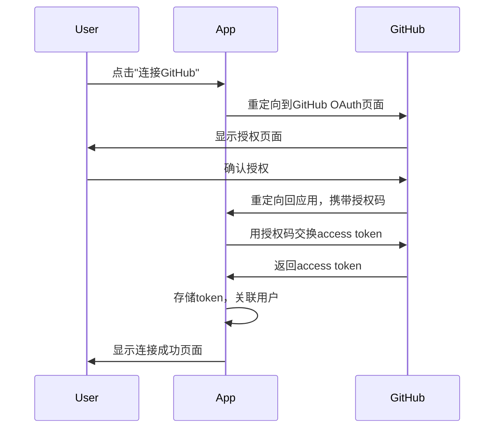

# GitHub OAuth 集成 PRD

## 1. 项目概述

### 1.1 目标
为Inspector SaaS服务集成GitHub OAuth登录功能，提供安全、便捷的用户认证和GitHub数据访问能力。

### 1.2 背景
- 当前使用全局GitHub token存在隐私和安全问题
- 需要支持多用户独立访问GitHub数据
- 提升用户体验，简化GitHub连接流程

## 2. 功能需求

### 2.1 核心功能
- GitHub OAuth登录认证
- 用户GitHub数据访问
- 权限管理和token存储
- 连接状态管理

### 2.2 用户流程



### 2.3 权限范围
```python
GITHUB_SCOPES = [
    "read:user",           # 读取用户基本信息
    "read:email",          # 读取邮箱信息
    "repo",                # 访问私有仓库
    "read:org"             # 读取组织信息
]
```

## 3. 技术设计

### 3.1 数据库设计
```sql
-- 用户表
CREATE TABLE users (
    id INTEGER PRIMARY KEY,
    username VARCHAR(255) UNIQUE,
    email VARCHAR(255),
    created_at TIMESTAMP DEFAULT CURRENT_TIMESTAMP
);

-- GitHub OAuth配置表
CREATE TABLE github_oauth_configs (
    id INTEGER PRIMARY KEY,
    user_id INTEGER,
    github_user_id INTEGER,
    github_username VARCHAR(255),
    access_token VARCHAR(255) ENCRYPTED,
    token_type VARCHAR(50),
    scope VARCHAR(255),
    expires_at TIMESTAMP,
    created_at TIMESTAMP DEFAULT CURRENT_TIMESTAMP,
    updated_at TIMESTAMP DEFAULT CURRENT_TIMESTAMP,
    FOREIGN KEY (user_id) REFERENCES users(id)
);
```

### 3.2 API设计
```python
# OAuth认证端点
GET /api/v1/auth/github                    # 重定向到GitHub OAuth
GET /api/v1/auth/github/callback           # OAuth回调处理

# 用户GitHub管理端点
GET /api/v1/users/me/github-status         # 获取连接状态
DELETE /api/v1/users/me/github-connection  # 断开连接
GET /api/v1/users/me/github-profile        # 获取GitHub用户信息
```

### 3.3 安全考虑
- 使用state参数防止CSRF攻击
- 加密存储access token
- 验证OAuth回调的完整性
- 实现token过期处理

## 4. 实施计划

### 4.1 第一阶段：基础OAuth实现
- [ ] 创建GitHub OAuth应用
- [ ] 实现OAuth认证流程
- [ ] 数据库表结构设计
- [ ] 基础API端点实现

### 4.2 第二阶段：用户界面集成
- [ ] 前端OAuth连接组件
- [ ] 连接状态显示
- [ ] 用户设置页面更新
- [ ] 错误处理和用户反馈

### 4.3 第三阶段：功能完善
- [ ] GitHub数据访问集成
- [ ] 权限管理优化
- [ ] 监控功能更新
- [ ] 测试和文档完善

## 5. 需要用户介入的部分

### 5.1 GitHub OAuth应用创建
用户需要在GitHub开发者设置中创建OAuth应用：
- 应用名称：Inspector
- 主页URL：https://your-domain.com
- 授权回调URL：https://your-domain.com/api/v1/auth/github/callback

### 5.2 环境变量配置
需要配置以下环境变量：
```bash
GITHUB_CLIENT_ID=your-github-client-id
GITHUB_CLIENT_SECRET=your-github-client-secret
GITHUB_REDIRECT_URI=https://your-domain.com/api/v1/auth/github/callback
```

### 5.3 域名和SSL证书
- 需要配置HTTPS域名
- 确保SSL证书有效
- 配置正确的回调URL

## 6. 风险评估

### 6.1 技术风险
- OAuth流程复杂性
- Token安全存储
- 错误处理完整性

### 6.2 业务风险
- 用户授权率
- 数据访问权限
- 合规性要求

## 7. 成功指标

### 7.1 技术指标
- OAuth成功率 > 95%
- API响应时间 < 2秒
- 错误率 < 1%

### 7.2 业务指标
- 用户连接率 > 80%
- 用户满意度 > 4.5/5
- 支持工单减少 > 50%

## 8. 后续规划

### 8.1 功能扩展
- 支持GitHub组织访问
- 多账户管理
- 权限精细化控制

### 8.2 技术优化
- Token自动刷新
- 缓存机制
- 性能监控 