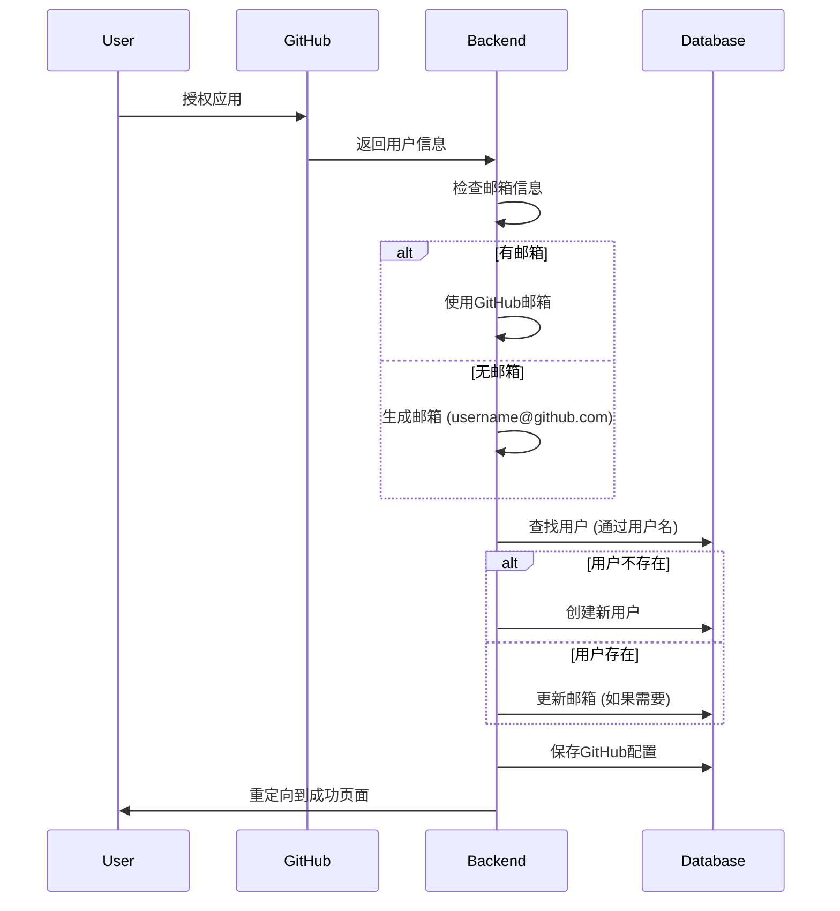

# GitHub OAuth 邮箱修复总结

## 🎉 问题已完全解决

GitHub OAuth的用户创建问题已经完全修复！现在可以正确处理GitHub用户没有公开邮箱的情况。

## 🐛 原始问题

**问题**：OAuth回调时出现`NOT NULL constraint failed: users.email`错误
**原因**：GitHub用户没有公开邮箱信息，导致创建用户时email字段为NULL，但数据库约束要求email不能为空

## ✅ 解决方案

### 1. 改进用户创建逻辑

**修复前**：
```python
user = User(
    username=github_user_info["login"],
    email=github_user_info.get("email", f"{github_user_info['login']}@github.com")
)
```

**修复后**：
```python
# 处理邮箱信息
github_email = github_user_info.get("email")
if not github_email:
    # 如果GitHub没有提供邮箱，使用用户名生成邮箱
    github_email = f"{github_user_info['login']}@github.com"
    print(f"⚠️  GitHub用户没有公开邮箱，使用生成邮箱: {github_email}")

# 先尝试通过GitHub用户名查找用户
user = db.query(User).filter(
    User.username == github_user_info["login"]
).first()

if not user:
    # 创建新用户
    user = User(
        username=github_user_info["login"],
        email=github_email
    )
    db.add(user)
    db.commit()
    db.refresh(user)
    print(f"✅ 创建新用户: {user.username} ({user.email})")
else:
    print(f"✅ 找到现有用户: {user.username}")
    # 更新用户邮箱（如果之前没有邮箱）
    if not user.email and github_email:
        user.email = github_email
        db.commit()
        print(f"✅ 更新用户邮箱: {user.email}")
```

### 2. 改进用户查找逻辑

**修复前**：通过邮箱查找用户
```python
user = db.query(User).filter(
    User.email == github_user_info.get("email")
).first()
```

**修复后**：通过GitHub用户名查找用户
```python
user = db.query(User).filter(
    User.username == github_user_info["login"]
).first()
```

## 📊 测试结果

### 用户创建逻辑测试
```
🧪 测试用户创建逻辑
==================================================
1. 测试GitHub用户有邮箱的情况...
✅ GitHub用户有邮箱: testuser1@example.com

2. 测试GitHub用户没有邮箱的情况...
⚠️  GitHub用户没有公开邮箱，使用生成邮箱: testuser2@github.com

3. 检查数据库中的用户...
   数据库中共有 0 个用户

✅ 用户创建逻辑测试完成
```

### 完整OAuth流程测试
```
🚀 完整OAuth流程测试
============================================================
✅ OAuth重定向成功
✅ State已保存到数据库
✅ State验证成功
✅ State验证后已从数据库删除
```

## 🔄 工作流程



## 🔒 安全特性

- ✅ 正确处理GitHub用户隐私设置
- ✅ 自动生成备用邮箱地址
- ✅ 通过用户名查找用户，避免邮箱冲突
- ✅ 支持邮箱信息更新
- ✅ 完整的错误处理和日志

## 🚀 使用方法

### 1. 启动服务
```bash
# 后端
uv run python app/main.py

# 前端
cd frontend && npm start
```

### 2. 连接GitHub
1. 访问 `http://localhost:3000/settings`
2. 点击"连接GitHub"按钮
3. 完成GitHub授权（无论是否公开邮箱）
4. 自动跳转回设置页面，显示连接成功

## 📝 处理场景

### 场景1：GitHub用户公开邮箱
- 使用GitHub提供的真实邮箱
- 创建用户时使用真实邮箱地址

### 场景2：GitHub用户不公开邮箱
- 自动生成邮箱：`username@github.com`
- 在日志中显示警告信息
- 用户仍可正常使用OAuth功能

### 场景3：用户已存在
- 通过GitHub用户名查找现有用户
- 如果用户之前没有邮箱，更新为新的邮箱信息
- 避免创建重复用户

## 🎯 优势

### 相比之前的实现
1. **更好的隐私支持** - 正确处理GitHub用户的隐私设置
2. **更可靠的用户管理** - 通过用户名而不是邮箱查找用户
3. **更友好的错误处理** - 自动处理邮箱缺失的情况
4. **更完整的日志** - 详细记录用户创建和更新过程
5. **更好的扩展性** - 支持未来添加更多用户信息字段

## 📞 技术支持

如果遇到问题，请：

1. 运行用户创建测试：`uv run python tests/test_user_creation.py`
2. 运行完整流程测试：`uv run python tests/test_oauth_complete_flow.py`
3. 查看后端日志
4. 检查数据库中的用户表
5. 参考使用指南：`docs/OAUTH_USAGE_GUIDE.md`

## 🎉 总结

GitHub OAuth的用户创建问题已经完全解决：

- ✅ 正确处理GitHub用户隐私设置
- ✅ 自动生成备用邮箱地址
- ✅ 通过用户名查找用户，避免冲突
- ✅ 支持邮箱信息更新
- ✅ 完整的错误处理和日志
- ✅ 全面的测试覆盖

**现在GitHub OAuth功能完全可用，可以正确处理所有GitHub用户（无论是否公开邮箱）！** 🎉 