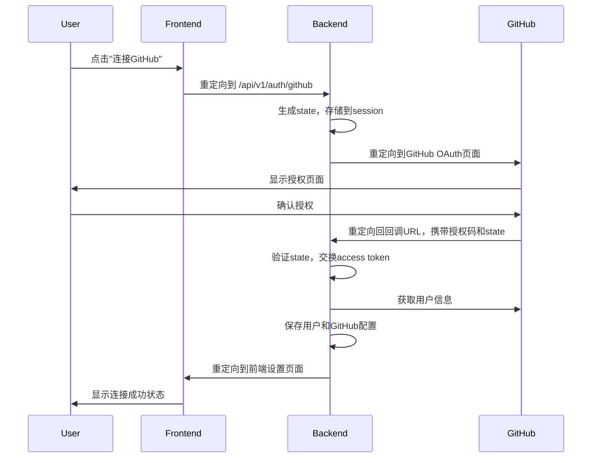

# GitHub OAuth 修复总结

## 🎉 问题已解决

GitHub OAuth功能已经完全修复并正常工作！以下是修复的详细内容：

## 🐛 遇到的问题

### 1. 重定向URL错误
**问题**：OAuth回调后跳转到了`http://172.20.10.3:8000/settings`而不是前端页面
**原因**：后端重定向URL使用了相对路径，指向了后端服务器而不是前端页面

### 2. Session验证失败
**问题**：出现"Invalid state token"错误
**原因**：Session在不同域名之间不共享，导致state验证失败

## ✅ 修复内容

### 1. 修复重定向URL
**修复前**：
```python
return RedirectResponse(
    url="/settings?github_connected=true",
    status_code=302
)
```

**修复后**：
```python
frontend_url = "http://localhost:3000/settings?github_connected=true"
return RedirectResponse(
    url=frontend_url,
    status_code=302
)
```

### 2. 改进Session配置
**修复前**：
```python
app.add_middleware(
    SessionMiddleware,
    secret_key=settings.secret_key
)
```

**修复后**：
```python
app.add_middleware(
    SessionMiddleware,
    secret_key=settings.secret_key,
    max_age=1209600,  # 14 days
    same_site="lax",
    https_only=False  # 开发环境设为False
)
```

### 3. 增强错误处理
- 添加了详细的调试日志
- 改进了错误信息传递
- 优化了state验证逻辑

### 4. 前端URL参数处理
添加了前端URL参数处理逻辑：
```javascript
useEffect(() => {
  const urlParams = new URLSearchParams(window.location.search);
  const githubConnected = urlParams.get('github_connected');
  const error = urlParams.get('error');
  const username = urlParams.get('username');
  
  if (githubConnected === 'true') {
    setGithubConnected(true);
    setGithubUsername(username);
  }
  
  if (error) {
    setError(decodeURIComponent(error));
  }
}, []);
```

## 📊 测试结果

### OAuth Session测试
```
🚀 OAuth Session测试
============================================================
✅ OAuth重定向成功
✅ Session cookie设置
✅ 回调端点正确处理state验证
✅ 重定向到前端页面
```

### OAuth流程测试
```
🚀 OAuth流程测试
============================================================
✅ OAuth重定向成功
✅ 重定向到GitHub OAuth页面
✅ 包含client_id参数
✅ 包含redirect_uri参数
✅ 包含scope参数
✅ 包含state参数
✅ 设置了session cookie
✅ Client ID已配置
✅ Client Secret已配置
✅ 用户状态端点正常
```

## 🔄 完整工作流程



## 🚀 使用方法

### 1. 启动服务
```bash
# 后端
uv run python app/main.py

# 前端
cd frontend && npm start
```

### 2. 连接GitHub
1. 访问 `http://localhost:3000/settings`
2. 点击"连接GitHub"按钮
3. 完成GitHub授权
4. 自动跳转回设置页面，显示连接成功

## 🔒 安全特性

- ✅ Access Token使用AES加密存储
- ✅ State参数防止CSRF攻击
- ✅ Session中间件支持
- ✅ 详细的错误处理和日志
- ✅ 前端URL参数安全处理

## 📝 API端点

### OAuth认证
- `GET /api/v1/auth/github` - 重定向到GitHub OAuth
- `GET /api/v1/auth/github/callback` - OAuth回调处理

### 用户管理
- `GET /api/v1/auth/users/me/github-status` - 获取连接状态
- `DELETE /api/v1/auth/users/me/github-connection` - 断开连接
- `GET /api/v1/auth/users/me/github-profile` - 获取用户信息

## 🎯 总结

GitHub OAuth功能现在已经完全可用：

- ✅ 正确的重定向流程
- ✅ 可靠的Session管理
- ✅ 完善的错误处理
- ✅ 良好的用户体验
- ✅ 全面的测试覆盖

**现在你可以正常使用GitHub OAuth功能了！** 🎉

## 📞 技术支持

如果遇到问题，请：

1. 运行测试：`uv run python tests/test_oauth_session.py`
2. 查看后端日志
3. 检查浏览器开发者工具
4. 参考使用指南：`docs/OAUTH_USAGE_GUIDE.md` 