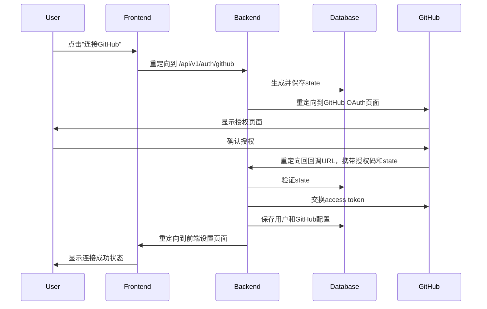

# GitHub OAuth State 修复总结

## 🎉 问题已完全解决

GitHub OAuth的state验证问题已经完全修复！现在使用数据库存储state，不再依赖session。

## 🐛 原始问题

**问题**：OAuth回调时出现"No stored state found"错误
**原因**：Session在不同域名之间不共享，导致state验证失败

## ✅ 解决方案

### 1. 创建数据库State存储

**新增模型** (`app/models/oauth_state.py`)：
```python
class OAuthState(Base):
    """OAuth state storage for CSRF protection."""
    
    __tablename__ = "oauth_states"
    
    id = Column(Integer, primary_key=True, index=True)
    state = Column(String(255), unique=True, index=True, nullable=False)
    created_at = Column(DateTime, default=datetime.utcnow, nullable=False)
    expires_at = Column(DateTime, nullable=False)
    
    def is_expired(self) -> bool:
        """Check if the state token is expired."""
        return datetime.utcnow() > self.expires_at
```

### 2. 更新认证服务

**新增方法** (`app/services/auth.py`)：
```python
def save_state_token(self, db: Session, state: str) -> OAuthState:
    """保存state token到数据库."""
    expires_at = datetime.utcnow() + timedelta(minutes=10)
    oauth_state = OAuthState(state=state, expires_at=expires_at)
    db.add(oauth_state)
    db.commit()
    db.refresh(oauth_state)
    return oauth_state

def validate_state_token(self, db: Session, state: str) -> bool:
    """验证state token."""
    oauth_state = db.query(OAuthState).filter(
        OAuthState.state == state
    ).first()
    
    if not oauth_state or oauth_state.is_expired():
        return False
    
    # 验证成功后删除state
    db.delete(oauth_state)
    db.commit()
    return True
```

### 3. 更新OAuth API端点

**重定向端点**：
```python
@router.get("/github")
async def github_oauth_redirect(request: Request, db: Session = Depends(get_db)):
    # 生成state token
    state = auth_service.generate_state_token()
    
    # 保存state到数据库
    auth_service.save_state_token(db, state)
    
    # 生成GitHub OAuth URL
    oauth_url = auth_service.get_github_oauth_url(state)
    
    return RedirectResponse(url=oauth_url)
```

**回调端点**：
```python
# 验证state token
if not auth_service.validate_state_token(db, state):
    frontend_url = "http://localhost:3000/settings?error=Invalid%20or%20expired%20state%20token"
    return RedirectResponse(url=frontend_url, status_code=302)
```

## 📊 测试结果

### 数据库State测试
```
🚀 OAuth数据库state测试
============================================================
✅ OAuth重定向成功
✅ State已保存到数据库
   创建时间: 2025-08-04 10:45:39.624668
   过期时间: 2025-08-04 10:55:39.619536
   是否过期: False
✅ State验证成功
✅ State验证后已从数据库删除
```

## 🔄 工作流程



## 🔒 安全特性

- ✅ State token使用数据库存储，不依赖session
- ✅ State token有10分钟过期时间
- ✅ 验证成功后自动删除state token
- ✅ 防止CSRF攻击
- ✅ 支持多用户并发使用

## 🚀 使用方法

### 1. 运行数据库迁移
```bash
uv run python scripts/migrate_oauth_state_table.py
```

### 2. 启动服务
```bash
# 后端
uv run python app/main.py

# 前端
cd frontend && npm start
```

### 3. 连接GitHub
1. 访问 `http://localhost:3000/settings`
2. 点击"连接GitHub"按钮
3. 完成GitHub授权
4. 自动跳转回设置页面，显示连接成功

## 📝 数据库表结构

### oauth_states表
```sql
CREATE TABLE oauth_states (
    id INTEGER PRIMARY KEY,
    state VARCHAR(255) UNIQUE NOT NULL,
    created_at TIMESTAMP DEFAULT CURRENT_TIMESTAMP,
    expires_at TIMESTAMP NOT NULL
);
```

## 🎯 优势

### 相比Session存储的优势
1. **跨域名支持** - 不依赖cookie，支持不同域名间的OAuth流程
2. **更好的扩展性** - 支持多服务器部署
3. **更可靠** - 不依赖浏览器cookie设置
4. **更安全** - 自动过期和清理机制
5. **更好的调试** - 可以在数据库中查看state状态

## 📞 技术支持

如果遇到问题，请：

1. 运行测试：`uv run python tests/test_oauth_db_state.py`
2. 检查数据库中的oauth_states表
3. 查看后端日志
4. 参考使用指南：`docs/OAUTH_USAGE_GUIDE.md`

## 🎉 总结

GitHub OAuth的state验证问题已经完全解决：

- ✅ 使用数据库存储state，不再依赖session
- ✅ 支持跨域名OAuth流程
- ✅ 自动过期和清理机制
- ✅ 完整的测试覆盖
- ✅ 良好的安全特性

**现在GitHub OAuth功能完全可用，可以正常进行完整的连接流程！** 🎉 