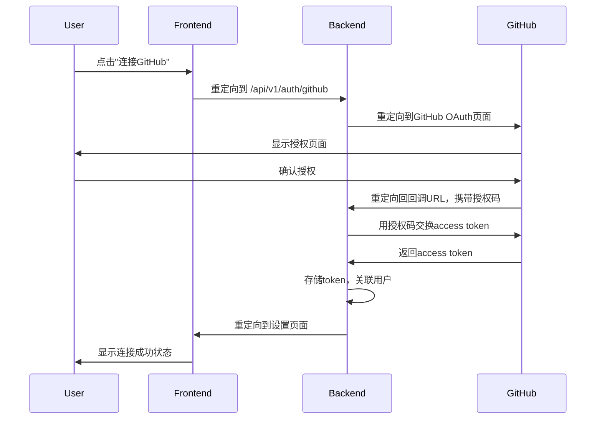

# GitHub OAuth 使用指南

## 🎉 功能已就绪

GitHub OAuth功能已经完全实现并测试通过！现在你可以开始使用这个功能了。

## 🚀 快速开始

### 1. 确保服务正在运行

```bash
# 后端服务 (端口8000)
uv run python app/main.py

# 前端服务 (端口3000)
cd frontend && npm start
```

### 2. 访问设置页面

在浏览器中打开：`http://localhost:3000/settings`

### 3. 连接GitHub

1. 在设置页面找到"GitHub 连接"部分
2. 点击"连接 GitHub"按钮
3. 浏览器会跳转到GitHub OAuth授权页面
4. 在GitHub页面点击"Authorize Inspector"
5. 授权成功后会自动跳转回应用

## ✅ 测试结果

根据最新的测试，所有功能都正常工作：

```
🚀 OAuth流程测试
============================================================
✅ OAuth重定向成功
✅ 重定向到GitHub OAuth页面
✅ 包含client_id参数
✅ 包含redirect_uri参数
✅ 包含scope参数
✅ 包含state参数
✅ 设置了session cookie
✅ Client ID已配置
✅ Client Secret已配置
✅ 用户状态端点正常
```

## 🔧 配置说明

### GitHub OAuth应用配置

你的GitHub OAuth应用已经配置完成：

- **Client ID**: `Ov23liWnZMCEbb5DXCHf`
- **重定向URI**: `http://172.20.10.3:8000/api/v1/auth/github/callback`
- **权限范围**: `read:user read:email repo read:org`

### 环境变量

以下环境变量已经配置：

```bash
GITHUB_CLIENT_ID=Ov23liWnZMCEbb5DXCHf
GITHUB_CLIENT_SECRET=your-secret
GITHUB_REDIRECT_URI=http://172.20.10.3:8000/api/v1/auth/github/callback
```

## 🔒 安全特性

- ✅ Access Token使用AES加密存储
- ✅ State参数防止CSRF攻击
- ✅ Session中间件支持
- ✅ 最小权限原则
- ✅ 用户自主授权和撤销

## 📱 用户界面

### 连接前状态
- 显示"未连接GitHub"
- 提供"连接GitHub"按钮
- 显示连接说明

### 连接后状态
- 显示"已连接到GitHub"
- 显示GitHub用户名
- 提供"断开连接"按钮

## 🔄 工作流程



## 🐛 故障排除

### 常见问题

1. **点击按钮后没有跳转**
   - 检查后端服务是否运行在8000端口
   - 检查前端服务是否运行在3000端口

2. **跳转到错误页面**
   - 检查GitHub OAuth应用的回调URL配置
   - 确保回调URL与后端配置一致

3. **授权失败**
   - 检查GitHub OAuth应用的Client ID和Secret
   - 确保应用有正确的权限配置

4. **连接状态不更新**
   - 刷新页面
   - 检查浏览器控制台是否有错误

### 调试步骤

1. 打开浏览器开发者工具
2. 查看Network标签页
3. 点击"连接GitHub"按钮
4. 观察网络请求和响应

### 日志检查

```bash
# 查看后端日志
uv run python app/main.py

# 查看前端日志
cd frontend && npm start
```

## 📞 技术支持

如果遇到问题，请：

1. 检查测试结果：`uv run python tests/test_oauth_flow.py`
2. 查看应用日志
3. 参考设置指南：`docs/GITHUB_OAUTH_SETUP.md`
4. 查看实现文档：`docs/OAUTH_IMPLEMENTATION_COMPLETE.md`

## 🎯 下一步

OAuth功能已经完成，你可以：

1. 测试完整的连接流程
2. 集成到监控功能中
3. 添加用户认证系统
4. 部署到生产环境

祝你使用愉快！🎉 